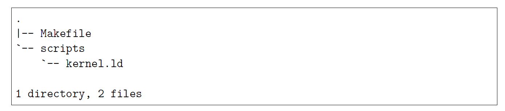

## 0 前言，环境准备

https://www.book-os.org/ 一个网站

跟着大佬的经验，一路学下去

-   工作环境：Ubuntu16 + clion

-   qemu

    ```shell
    apt install qemu
    ```

    ```shell
    ln -s /usr/bin/qemu-system-i386 /usr/bin/qemu
    ```

    通过符号链接，让 qemu 命令生效

-   Makefile

```makefile
#! Makefile

C_SOURCES = $(shell find . -name "*.c") # 查找后缀为 .c 的文件
C_OBJECTS = $(patsubst %.c, %.o, $(C_SOURCES)) # 替换以 .c 结尾的变量为 .o 结尾的变量
S_SOURCES = $(shell find .  -name "*.s") # 查找后缀为 .s 的文件
S_OBJECTS = $(patsubst %.s, %.o, $(S_SOURCES))

CC = gcc # 编译器
LD = ld # 连接器
ASM = nasm # 汇编器

C_FLAGS = -c -Wall -m32 -ggdb -gstabs+ -nostdinc -fno-builtin -fno-stack-protector -I include  # gcc 编译参数

LD_FLAGS = -T scripts/kernel.ld -m elf_i386 -nostdlib # ld 链接参数

ASM_FLAGS = -f elf -g -F stabs # nasm 汇编参数

all : $(S_OBJECTS) $(C_OBJECTS) link update_image

.c .o:
   @echo  编译代码文件 $< ...
   $(CC) $(C_FLAGS) $< -o $@

.s .o:
   @echo  编译汇编文件 $< ...
   $(ASM) $(ASM_FLAGS) $<


link:
   @echo 链接内核文件...
   $(LD) $(LD_FLAGS) $(S_OBJECTS) $(C_OBJECTS) -o mix_kernel

.PHONY:clean
clean:
   $ (RM) $(S_OBJECTS) $(C_OBJECTS) mix_kernel

.PHONY:update_image
update_image:
   mount floppy.img /mnt/kernel
   cp mix_kernel /mnt/kernel/mix_kernel
   sleep 1
   unmount /mnt/kernel

.PHONY:mount_image
mount_image:
   mount floppy.img /mnt/kernel

.PHONY:unmount_image
unmount_image:
   umount /mnt/kernel

.PHONY:qemu
qemu:
   qemu -fda floppy.img -boot alias

.PHONY:bochs
bochs:
   bochs -f tools/bochsrc.txt

.PHONY:debug
debug:
   qemu -S -s -fda floppy.img -boot a &
   sleep 1
   cgdb -x tools/gdbinit
```

然后是链接器脚本 kernel.ld

```shell
/*
 * kernel.ld -- 针对kernel 格式所写的链接脚本
 */

ENTRY(start)
SECTIONS
{
    /* 段起始位置*/

    . = 0x100000;
    .text :
    {
        (.text)
        . = ALIGN(4096);
    }

    .data :
    {
        *(.data)
        *(.rodata)
        . = ALIGN(4096);
    }

    .bss :
    {
        *(.bss)
        . = ALIGN(4096);
    }

    .stab :
    {
        *(.stab)
        . = ALIGN(4096);
    }

    .stabstr :
    {
        *(.stabstr)
        . = ALIGN(4096)
    }

    /DISCARD/ : { *(.comment) *(.eh_frame) }

}
```

这个脚本告诉ld程序如何构造我们所需的内核映像文件。

首先，脚本声明了内核程序的入口地址是符号"start" 。然后声明了段起始位置0x100000（1MB），接着是第一个段.text段（代码段）、已初始化数据段.data、未初始化数据段.bss以及它们采用的4096的页对齐方式。Linux GCC 增加了额外的数据段.rodata，这是一个只读的已初始化数据段，放置常量什么的。另外为了简单起见，我们把.rodata段和.data段放在了一起。最后的stab和stabstr段暂时无需关注，等到后面讲到调试信息的时候就会明白。

目录结构如下：



## 1 计算机启动过程，GRUB 以及 multiboot 标准

GRUB 的全称为 GRand Unified Bootloader, 是一个多重操作系统管理器，用来引导不同的操作系统（也就是，Windows，Linux 等）。

我们的目标内核是 32 位的。64 位内核会变得更麻烦。

我们的内核使用 32 位的地址总线来寻址，也就是 4G 的地址空间。第一个问题，这 4G 的地址空间指向哪里？

当然有内存，但是除了内存还有 BIOS，显卡，声卡，网卡等设备，CPU 要和这些外设通信，就必须知道通讯地址。

有两种方案：

-   **端口统一编址** ：把所有和外设存储单元对应的端口直接直接编址到这 4G 的地址空间里，当我们对某一个地址进行访问的时候实际上是在访问某个外设的存储单元。
-   **端口独立编址**：外设存储单元的对应端口没有编址在地址空间里面，而是另行独立编址。

x86 架构部署的采用了端口独立编址，又部分的采用了端口统一编址。部分外设的部分存储单元可以直接通过某个内存地址访问，而其他部分在一个独立的端口地址空间中，需要使用 in/out 指令去访问。

CPU 在加电以后的启动过程：

按下电源开始。首先是 CPU 重置。主板加电之后再电压尚未稳定之前，主板上的北桥控制芯片会向 CPU 发出重置信号（Reset），此时 CPU 进行初始化。当电压稳定后，控制芯片会撤销 Reset 信号，CPU 便开始了模式化的工作。此时形成的第一条指令的地址是 0xFFFFFFF0, 从这里开始，CPU 就进入一个“取指令-翻译指令-执行”的循环了。

容易想到 0xFFFFFFF0 这个地址指向 BIOS 芯片。计算机刚加电的时候，内存等芯片尚未初始化，所以只能指向 BIOS 芯片里已经被“固化”的指令了。

然后是 BIOS 的 POST（Power On Self Test，上电自检）过程，BIOS 对各个部件进行初始化，如有错误会给出报警音。当 BIOS 完成这些工作后，就要再外部存储设备中寻找操作系统，一般是硬盘。当然 BIOS 中有张启动设备表，BIOS 会按照这个表里面列出的顺序查找可启动设备。设备是否可以启动的规则是：如果这个存储设备的第一个扇区中 512 个字节的最后两个字节是 0x55 和 0xAA，呢么改存储设备就是可以启动的。

当 BIOS 找到可以启动的设备后，便将改设备的第一个扇区加载到内存的 0x7c00 地址除，并且跳转过去执行。而我们编写操作系统内核，就从构造这个可启动的扇区开始。

因为一个扇区只有 512 个字节，放不下太多的代码，所以常规的做法是在这里写下载入操作系统内核的代码，这段代码就是所谓的 bootloader 程序。一般意义上的 bootloader 负责将软硬件的环境设置到一个合适的状态，然后加载操作系统内核并且移交执行权限。而 GRUB 是一个来自 GNU 项目的多操作系统启动程序。它是**多启动规范的实现**，允许用户可以再计算机内同时拥有多个操作系统，并在计算机启动时选择希望运行的操作系统。

如何让 GRUB 加载我们自己的小内核呢，这需要用到 GRUB 提供的 multiboot 规范。这份规范时描述如何构造一个能够被 GRUB 识别，并且按照我们定义的规则去加载的操作系统内核。具体的协议百度，后续有精力再来研究吧。接下来我们直接构建一个可以运行的 “ Hello，mix_kernel OS" 程序，然后上机运行。

## 2 裸机上运行的 Hello OS Kernel

### 2.1 Makefile 和 ld 脚本的简单解释

```makefile
C_FLAGS = -c -Wall -m32 -ggdb -gstabs+ -nostdinc -fno-builtin -fno-stack-protector -I include  # gcc 编译参数
```

几个重要参数

-   -m32 是生成 32 位代码，开发环境也可以是 64 位 Linux 系统
-   -ggdb 和 -gstabs+ 是添加相关的调试信息
-   -nostdinc 是不包括 c 语言的标准库的头文件，因为库函数都是再特定操作系统平台之上的实现，我们要实现的是一个平台，所以想用 c 语言库函数就只能自己实现了。
-   -fno-builtin 是要求 gcc  不主动使用自己的内建函数，除非是显式声明
-   -fno-stack-protector 是不使用栈保护等检测

接下来是 ld 链接命令的参数：

```makefile
LD_FLAGS = -T scripts/kernel.ld -m elf_i386 -nostdlib # ld 链接参数
```

-   -T scripts/kernel.ld 是使用我们自己的链接器脚本
-   -m elf_i386 是生成 i386 平台下的 ELF 格式的可执行文件，这是 Linux 下的可执行文件格式。
-   -nostdlib 是不链接 c 语言的标准库

一个可执行文件大致由代码段和数据段组成，但是操作系统如何正确的加载它呢？即可执行文件向操作系统提供代码段和数据段位置等信息，以便操作系统正确找到它的代码段和数据段并加载执行。通常这个信息被统一组织放在可执行文件的头部区域。不同的操作系统设计了不同的组织方式，Linux 系统常见的 ELF（Executable and Linkable Format，可执行链接格式）格式，Windows 下常见的 PE（Portable Executalbe, 可移植的可执行文件）格式。而 ld 支持很多中链接格式，我们可以再参数中指定。选用 ELF 原因是 GRUB 可以检测识别出 ELF 格式的可执行文件，并且能找到相关的代码段和数据段的位置信息，从而正确的把我们的内核加载到正确的位置上去。

只要按照 GRUB Multiboot 标准生成规范的 Multiboot 引导信息，同时使用标准的 ELF 格式，GRUB 就能把我们的内核正确的加载和执行了。

### 2.2 启动镜像的制作

一个现实的问题，小内核放在哪里，硬盘？有点麻烦。先选择一个 1.44MB 的软盘吧，简单些

文件系统，是指**操作系统用于明确磁盘和分区上的文件存储的方法和数据结构**，即在磁盘上组织文件的方法。软盘一般使用 FAT12 文件系统。GRUB 支持从很多常见的文件系统中去读取和载入内核文件，当然包括 FAT12 格式。

### 2.3 内核的入口和初始化


